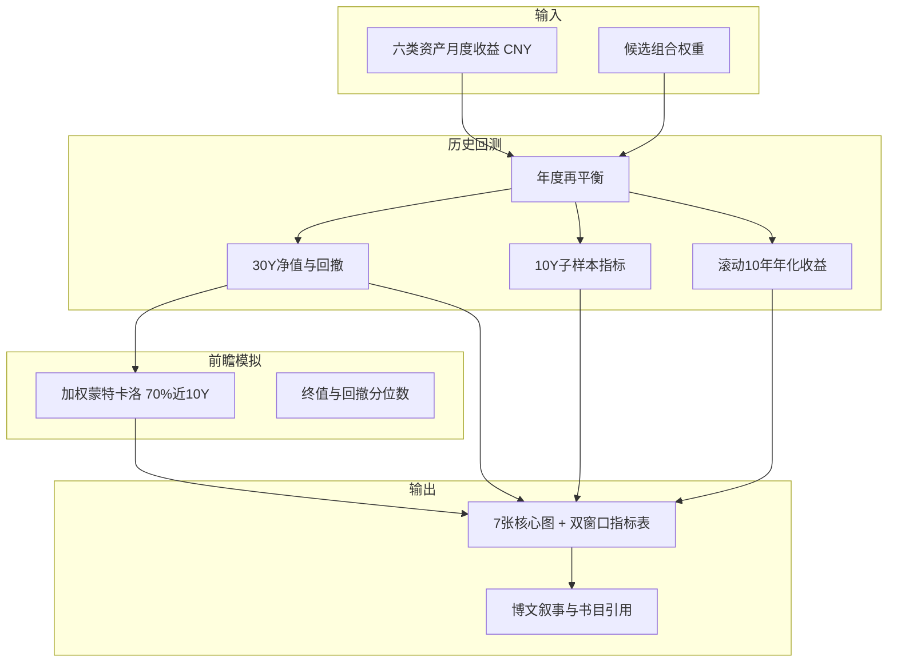

# 长期投资组合探讨——30% 最大回撤预期下的最优解

## 已确认前提

- **回撤标准**：按你选择的「**心理承受约 30% 回撤**」设计——不以「历史最大回撤必须 ≤30%」为硬约束，而是以「典型/可预期的回撤深度落在 30% 左右、在此风险预算下尽量多赚」为主线；文中会如实标注历史最大回撤（可能略超 30%）。
- **时间窗口**：**全样本 30 年（1996–2025）作基准参照**，同时对**近 10 年（2016–2025）加权加强**——当前市场结构与宏观环境与 90 年代差异大，优化排序与蒙特卡洛抽样更侧重近十年，但仍用 30 年全周期检验极端情形。
- **内链格式**：后续文内引用统一使用 `https://myq0721.github.io/YYYY/MM/DD/pinyin-slug/` 形式，例如 [一套可机械执行的个人资产配置方案](https://myq0721.github.io/2026/06/22/yi-tao-ke-ji-jie-zhi-xing-de-ge-ren-zi-chan-pei-zhi-fang-an/)、[四种投资组合三十年回测研究报告](https://myq0721.github.io/2026/06/25/si-chong-tou-zi-zu-he-san-shi-nian-hui-ce-yan-jiu-bao-gao/)。

## 目标产出

新建文章 [`source/_posts/长期投资组合探讨——30%最大回撤预期下的最优解.md`](source/_posts/长期投资组合探讨——30%最大回撤预期下的最优解.md)：

```yaml
---
title: 长期投资组合探讨——30%最大回撤预期下的最优解
date: 2026-06-26 12:00:00
categories: 财经
tags: [投资, 资产配置, 复利, 回撤, 理财]
toc: true
summary: 在约 30% 回撤风险预算下，如何设计长期复利组合；含经典方案对照、权重优化与蒙特卡洛模拟。
---
```

图表目录：[`source/images/portfolio-dd30/`](source/images/portfolio-dd30/)（Hexo 引用路径 `/images/portfolio-dd30/xxx.png`）。

---

## 分析框架



**资产池**（与上一篇一致，便于对照）：`nasdaq`、`sp500`、`csi300`、`gold`、`bonds`、`cash`。

**方法论延续**：人民币计价、每年末再平衡、数据源与局限说明复用 [`tools/portfolio_backtest_30y.py`](tools/portfolio_backtest_30y.py) 口径。

### 双窗口加权（30 年参照 + 近 10 年加强）

所有候选组合同时计算两套指标：

| 窗口 | 区间 | 用途 |
|------|------|------|
| **全周期** | 1996–2025（约 30 年） | 极端回撤、长期复利、与上一篇报告对照 |
| **近十年** | 2016–2025 | 优化排序主权重、蒙特卡洛抽样加强 |

**综合评分**（用于 DD30 网格搜索排序）：

```
Score = 0.65 × Calmar_10Y + 0.35 × Calmar_30Y
```

（Calmar = 年化收益 / |最大回撤|；若需并列决胜，次要看 `0.65 × AnnRet_10Y + 0.35 × AnnRet_30Y`）

**回撤筛选**仍用 **全周期最大回撤** 落在 [-40%, -22%]——心理承受力要看「历史上最糟的一次」，不能只看近十年。

**蒙特卡洛加权抽样**：
- 区块自助法（块长 12 个月）
- 每个区块从全样本中抽取时：**70% 概率来自 2016 年后子样本，30% 来自 1996–2015 年**
- 路径仍为 1000 × 360 个月；文中说明「模拟更贴近近十年宏观与资产相关性，但保留对早期危机模式的抽样」

**对照表呈现**：主表并列展示 `30Y` 与 `10Y` 的年化收益、最大回撤、夏普、Calmar；正文强调 DD30 是按加权 Score 选出，而非仅看 30 年单一指标。

---

## 候选组合（对照组 + 优化组）

| 代号 | 名称 | 权重要点 | 文献/网络出处 |
|------|------|----------|---------------|
| **Blog** | 博客实操方案 | 纳指 40% / 黄金 20% / 沪深300 10% / 现金 30% | 你的 [机械执行方案](https://myq0721.github.io/2026/06/22/yi-tao-ke-ji-jie-zhi-xing-de-ge-ren-zi-chan-pei-zhi-fang-an/) |
| **R3** | 回测报告组合3 | 纳指30 / 标普20 / 沪深300 10 / 黄金20 / 现金20 | [三十年回测报告](https://myq0721.github.io/2026/06/25/si-chong-tou-zi-zu-he-san-shi-nian-hui-ce-yan-jiu-bao-gao/) |
| **6040** | 经典股债 60/40 | 股票端纳指+标普合计 60% / 债券 40% | Bogle / Malkiel 传统配置 |
| **PP** | 永久组合 | 标普25 / 黄金25 / 债券25 / 现金25 | Harry Browne, *Fail-Safe Investing* |
| **AW** | 全天候简化版 | 股票30 / 债券55 / 黄金15（现金并入债券端） | Ray Dalio / Bridgewater All Weather |
| **DD30** | **本文推荐：回撤预算型** | 由网格搜索得出 | 下文优化逻辑 |

### DD30 优化逻辑（软约束 30% 回撤 + 近十年加权）

1. 在六资产上按 **5% 步长**网格搜索（权重和为 1，单资产 0–60%）。
2. 对每组权重分别计算 **30Y** 与 **10Y** 子样本指标：年化收益、最大回撤、夏普、Calmar。
3. **筛选带**：**全周期**最大回撤落在 **[-40%, -22%]**。
4. **排序**：按加权 `Score = 0.65×Calmar_10Y + 0.35×Calmar_30Y` 降序；取得分最高者为 **DD30**。
5. 若网格最优与 Blog/R3 接近，文中说明「数据验证了现有方案」；若偏离明显，给出调整建议，并解释是近十年结构（如美股科技、A 股波动、黄金避险）驱动了权重变化。

> 上一篇回测显示：组合3 最大回撤约 **-37.9%**、组合4 约 **-16.5%**。本篇的 DD30 应落在二者之间，作为「愿意承受约三成回撤、但仍要成长」的折中点。

---

## 图表清单（6 张 PNG + 1 张热力图）

由新脚本 [`tools/portfolio_dd30_analysis.py`](tools/portfolio_dd30_analysis.py) 生成：

| 文件 | 内容 |
|------|------|
| `cumulative_nav.png` | 各候选组合 + DD30 累计净值（起点=1） |
| `drawdown.png` | 最大回撤曲线；标注 -30% 参考线 |
| `rolling_10y_return.png` | 滚动 10 年年化收益率；可叠加近十年区间底色标注 |
| `metrics_30y_vs_10y.png` | **新增**：候选组合 30Y vs 10Y 年化/回撤分组柱状图 |
| `monte_carlo_fan.png` | 1000 次蒙特卡洛 30 年净值扇形图（P10/P50/P90） |
| `monte_carlo_maxdd_hist.png` | 模拟路径的最大回撤分布直方图（检验「30% 回撤预算」） |
| `correlation_matrix.png` | 六资产月度收益相关性热力图 |
| `return_vs_drawdown.png` | 收益-回撤散点（候选组合 + 网格搜索前沿点，标出 DD30） |

**蒙特卡洛设定**（文中披露）：
- 方法：**加权区块自助法**（块长 12 个月）：抽块时 70% 来自 2016–2025，30% 来自 1996–2015
- 路径：1000 条 × 360 个月（30 年）
- 每年末再平衡（与历史回测一致）
- 输出：终值分位数、最大回撤分位数；并与**未加权**全样本蒙特卡洛对照（可在附录或脚注简述差异）

---

## 代码结构

1. **抽取公共模块** [`tools/portfolio_data.py`](tools/portfolio_data.py)：从 [`tools/portfolio_backtest_30y.py`](tools/portfolio_backtest_30y.py) 抽出 `load_asset_returns()`、FX/French/akshare 加载与 `backtest_portfolio()`，避免重复。
2. **新分析脚本** [`tools/portfolio_dd30_analysis.py`](tools/portfolio_dd30_analysis.py)：候选组合回测、网格优化、蒙特卡洛、绘图，输出 `metrics.json` 到 `source/images/portfolio-dd30/`。
3. **原脚本** [`tools/portfolio_backtest_30y.py`](tools/portfolio_backtest_30y.py) 改为 `from portfolio_data import ...`，行为不变。

---

## 文章结构大纲

1. **引言**：30% 回撤作为长期投资者常见「痛苦阈值」；与 [机械执行方案](https://myq0721.github.io/2026/06/22/yi-tao-ke-ji-jie-zhi-xing-de-ge-ren-zi-chan-pei-zhi-fang-an/)、[三十年回测](https://myq0721.github.io/2026/06/25/si-chong-tou-zi-zu-he-san-shi-nian-hui-ce-yan-jiu-bao-gao/) 的衔接。
2. **理论框架（简）**：
   - 复利与回撤的权衡（Calmar、风险预算）
   - 经典组合回顾：60/40、永久组合、全天候、三基金组合
3. **方法论**：资产池、CNY、再平衡、**双窗口加权逻辑**、蒙特卡洛假设与局限。
4. **候选组合对照表**：并列 **30Y / 10Y** 年化、波动、最大回撤、夏普、Calmar、净值；附加权 Score。
5. **图表解读**：6+1 张图逐一说明。
6. **DD30 推荐方案**：权重表 + 与 Blog 方案差异 + 执行建议（ETF 映射、再平衡频率）。
7. **设计思路总结**：在 ~30% 回撤预算下，**股票成长 + 黄金/债券缓冲 + 充足现金/债券弹药** 的一般原则。
8. **参考文献**（正文脚注式 + 文末书单）：

**书籍**（计划引用）：
- Benjamin Graham, *The Intelligent Investor*
- Burton Malkiel, *A Random Walk Down Wall Street*
- John Bogle, *The Little Book of Common Sense Investing*
- William Bernstein, *The Four Pillars of Investing*
- Harry Browne, *Fail-Safe Investing*（永久组合）
- David Swensen, *Unconventional Success*（耶鲁模型）
- Tony Robbins / Ray Dalio 相关章节（全天候）

**网络/经典组合**：
- [Bogleheads 三基金组合](https://www.bogleheads.org/wiki/Three-fund_portfolio)
- [Permanent Portfolio 介绍](https://www.permanentportfoliofunds.com/)
- [Golden Butterfly](https://www.portfoliocharts.com/portfolio/golden-butterfly/)（Portfolio Charts）
- Bridgewater All Weather 公开材料摘要

9. **免责声明**。

---

## 实施步骤

1. 重构 `portfolio_data.py`，确保原回测脚本仍可运行。
2. 实现 `portfolio_dd30_analysis.py` 并运行，生成图表与 `metrics.json`。
3. 根据数值撰写 Markdown 长文，嵌入全部图片与表格。
4. `npm run build` 验证文章与图片路径；确认无 `scripts/` 目录误加载问题。

---

## 预期结论方向（待回测验证后写入正文）

基于上一篇数据，初步判断：
- **Blog 方案（40% 纳指）** 历史回撤可能 **高于** 30% 心理线，需用数据说话；
- **永久组合** 回撤过浅、收益偏低，不适合「30% 预算换更高复利」；
- **DD30 优化解**  Likely 在 **纳指 25–35% + 黄金 15–20% + 债券 10–20% + 沪深300 5–15% + 现金 15–25%** 区间；
- 若 DD30 与 Blog/R3 接近，文章结论为「现有方案已在风险预算内接近最优，仅需微调」。
